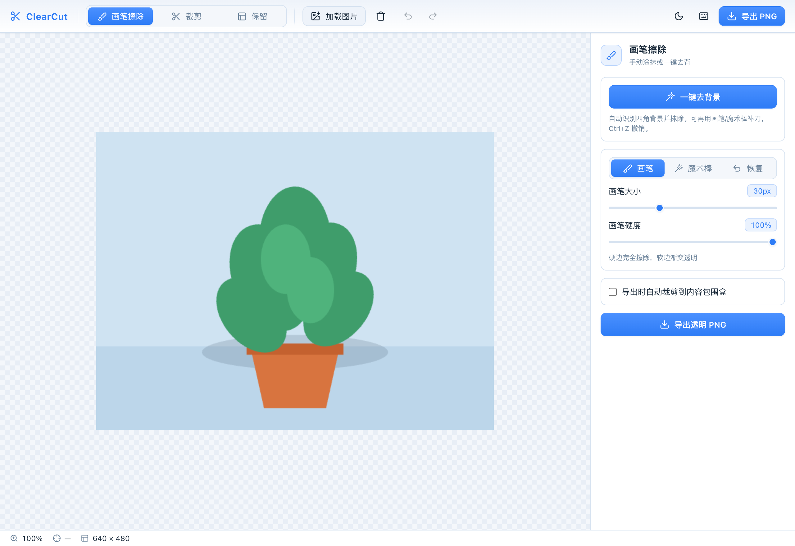
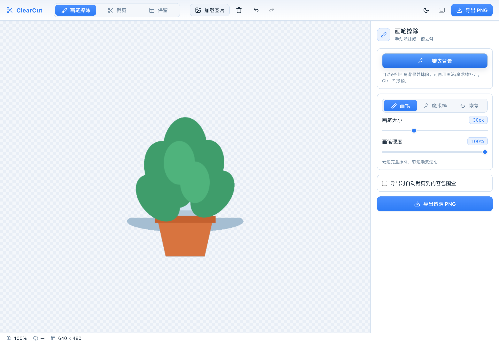
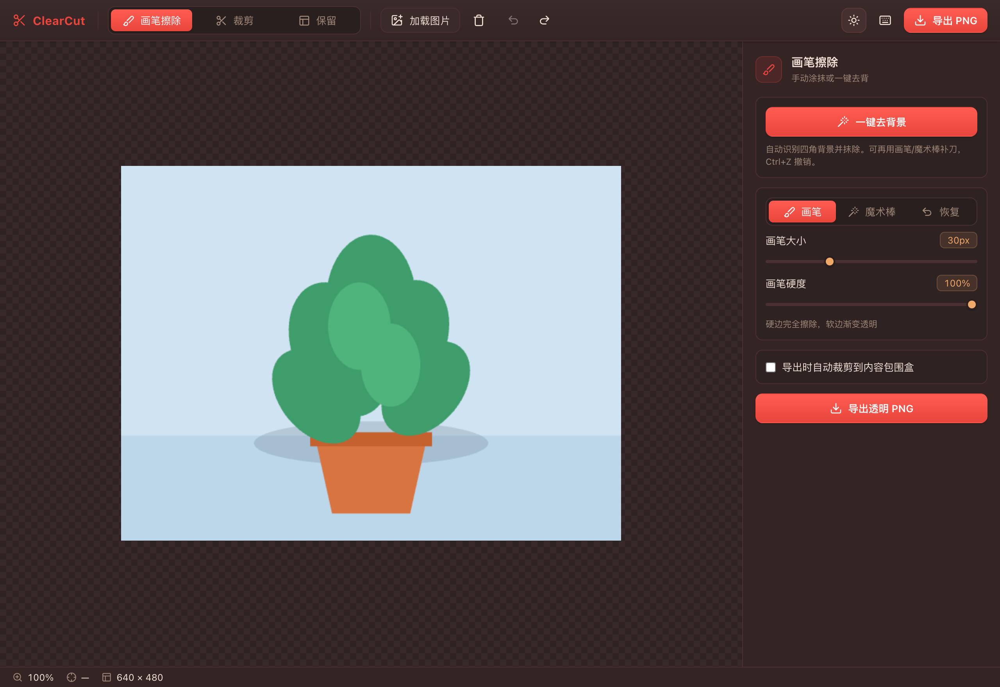
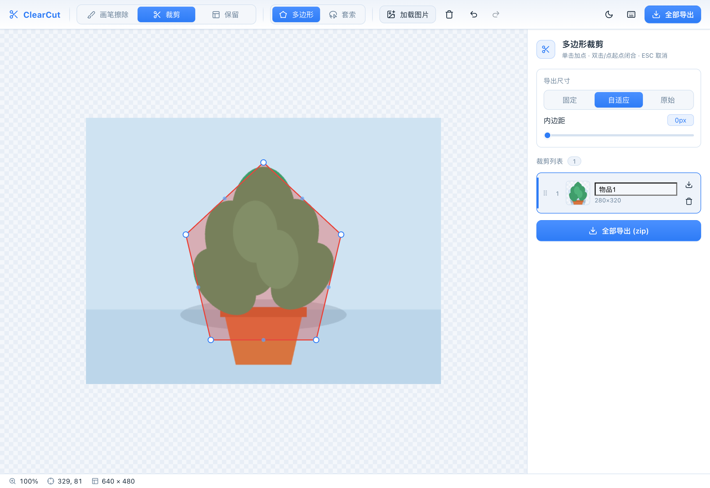

# ClearCut

基于浏览器的图片编辑工具，用于从复合场景图中提取单个物品素材，输出透明背景 PNG。纯前端运行，无需后端服务。

## 界面预览

| 画笔擦除 / 一键去背 | 一键去背效果 |
| :---: | :---: |
|  |  |
| **暗色主题** | **多边形裁剪** |
|  |  |

## 技术栈

| 类别 | 技术 |
| --- | --- |
| 框架 | React 18 + TypeScript |
| 画布 | react-konva / Konva.js |
| 状态管理 | Zustand + Immer |
| 打包导出 | JSZip (Web Worker) + file-saver |
| 构建工具 | Vite |
| 包管理 | pnpm |

## 功能概览

ClearCut 提供三种编辑模式，通过顶部工具栏切换：

### 模式一：画笔擦除 / 一键去背

包含手动画笔、魔术棒与恢复三种工具，共用同一张遮罩，可混合使用、统一撤销。

**一键去背景：**
- 自动取图片四角为种子，连通漫水去掉背景
- 适合纯色 / 简单背景；去背后可继续画笔或魔术棒补刀

**魔术棒：**
- 在画布上点击背景，擦除与点击点颜色相近的区域
- 容差可调（越大去除范围越广）
- 连通模式（仅相连区域）/ 全局模式（清除全图同色）

**手动画笔：**
- 圆形画笔，大小可调 (1-100px)，硬度可调（硬边到羽化渐变）
- 光标跟随画笔预览圈，实时反馈
- 快速移动时自动路径插值补点，避免断线

**恢复：**
- 在误擦区域涂抹，恢复对应位置的原图像素
- 大小 / 硬度与手动画笔共用配置，可精修去背边缘

- 每次操作（笔画 / 魔术棒 / 一键去背 / 恢复）结束自动保存快照，支持撤销/重做
- 导出透明背景 PNG，可选自动裁剪到内容包围盒

### 模式二：多边形裁剪（批量裁剪）

在图片上绘制多个多边形区域，每个区域裁剪为独立图片，批量导出。

**绘制方式：**
- 多边形模式：单击加顶点，双击或点击起点闭合
- 套索模式：按住拖拽自由勾勒，松开自动闭合
- 点选模式：在透明背景图上点击物品，按 alpha 连通域自动框出包围盒；「一键全分」一次性切出全图所有不透明物品（透明阈值可调，自动过滤噪点）

**编辑交互：**
- 顶点拖拽调整位置
- 整体拖拽移动多边形
- 双击边线中点插入新顶点
- 右键顶点删除（至少保留 3 个）
- Delete 键删除选中多边形

**导出尺寸配置：**
- 固定尺寸 — 指定宽高，内容等比缩放居中
- 自适应统一 — 取最大包围盒作为统一尺寸
- 原始尺寸 — 各自按包围盒大小导出

**批量导出：**
- 全部导出为 ZIP 包，文件名 `{序号}_{名称}.png`
- ZIP 内含 `manifest.json`（名称、原始坐标、导出尺寸）
- 支持单个多边形单独导出
- ZIP 打包在 Web Worker 中执行，不阻塞 UI

**侧边栏：**
- 实时裁剪预览缩略图
- 点击列表项高亮画布上对应多边形
- 拖拽排序，影响导出命名顺序

### 模式三：多边形保留（反向裁剪）

绘制一个或多个多边形区域，内部保留原图，外部变为透明。

- 多边形绘制/编辑交互同模式二
- 支持多个区域，所有多边形内部并集保留
- 实时预览：所有多边形外部叠加半透明遮罩

**导出选项：**
- 保留原图尺寸（外部透明）
- 裁剪到包围盒
- 指定固定尺寸

**智能点选（SAM）：**

「保留」模式下新增 **智能点选** 工具，用 SlimSAM（浏览器端 Segment Anything）按点击自动描边抠出物品：

- **单击物品**：自动识别并选中该物体（描边）
- **Shift + 单击**：加负点排除误选区域，即时细化
- **Enter / 「确认」**：确认当前物体并开始下一个，可连续选多个物品
- **Esc / 「放弃」**：放弃当前未确认的选择
- 选中区域原位保留、其余透明，复用上面的三种导出尺寸选项
- 纯前端推理：WebGPU 优先、WASM 回退；模型懒加载（首次点击才下载）

> **模型准备**：默认从本地自托管（`public/models`）加载，部署前先拉取一次模型权重：
> ```bash
> pnpm sam:download            # 走 HuggingFace 官方
> HF_MIRROR=1 pnpm sam:download # 走 hf-mirror.com 镜像（国内更稳）
> ```
> 也可改用在线 CDN：设环境变量 `VITE_SAM_MODEL_SOURCE=remote`（官方）或 `mirror`（镜像），此时无需下载、但运行时依赖外网。

### 大资源加载与部署（ORT / LaMa 走 CDN）

体积大的资源不入库（见 `.gitignore`），采用 **本地优先、CDN 兜底**：本地 `public/` 下有就用本地，没有则自动从 CDN 拉同名路径。

| 资源 | 大小 | 策略 |
| --- | --- | --- |
| `public/models/Xenova/`（SAM） | 小 | 纯本地，随 git 上传，**不走 CDN** |
| `public/ort/`（ORT wasm） | ~74MB | 本地优先 + CDN 兜底 |
| `public/models/lama/lama_fp32.onnx`（LaMa） | 198MB | 本地优先 + CDN 兜底 |

本地拉取大资源（开发/验证用）：
```bash
pnpm ort:assets     # 从 node_modules 拷 ORT wasm 到 public/ort（postinstall 已自动执行）
pnpm lama:download  # 下载 LaMa fp32 权重到 public/models/lama
```

**部署到 CDN：** 把 `public/ort/`、`public/models/lama/` 整目录上传到 CDN（保持目录结构一致），并设环境变量：
```env
# CDN 根地址，结构与 public/ 一致，末尾保留斜杠
VITE_ASSET_CDN=https://你的域名/ClearCut/
```
> 单独覆盖某一项可用 `VITE_ORT_WASM_URL` / `VITE_LAMA_MODEL_URL`（完整 URL，优先级最高）。

> ⚠️ **跨源头要求**：本应用启用了 COOP/COEP(`require-corp`) 以开多线程 WASM。CDN 上这些文件**必须**返回以下响应头，否则会被浏览器拦截：
> ```
> Cross-Origin-Resource-Policy: cross-origin
> Access-Control-Allow-Origin: *
> ```
> SAM 因同源本地加载，不受此限制。

## 通用功能

### 图片加载
- 按钮选择文件（jpg / png / webp / bmp）
- 拖拽文件到画布
- Ctrl+V 粘贴剪贴板图片
- 加载后自适应缩放到视口

### 画布操作
- 滚轮缩放（以光标为中心）
- 空格 + 拖拽平移
- 棋盘格背景表示透明区域

### 撤销/重做
- 全局栈，跨模式共用，上限 30 步
- 覆盖操作：笔画、多边形创建/编辑/删除

### 清除图片
- 工具栏一键清除当前图片，带确认弹窗防误删
- 清除后擦除遮罩与裁剪数据一并重置

### 主题切换
- 暗色 / 亮色双主题，工具栏一键切换（太阳 / 月亮图标）
- 首次进入跟随系统配色偏好（`prefers-color-scheme`）
- 手动选择后写入 localStorage 持久化；favicon 随主题切换

### 快捷键

| 快捷键 | 功能 |
| --- | --- |
| `Ctrl + Z` | 撤销 |
| `Ctrl + Shift + Z` | 重做 |
| `Ctrl + V` | 粘贴剪贴板图片 |
| 滚轮 | 缩放画布 |
| 空格 + 拖拽 | 平移画布 |
| 单击 | 添加多边形顶点 |
| 双击 / 点起点 | 闭合多边形 |
| 套索：按住拖拽 | 自由勾勒，松开闭合 |
| 双击边中点 | 插入新顶点 |
| 右键顶点 | 删除该顶点（≥3） |
| `Esc` | 取消当前绘制 |
| `Delete` | 删除选中多边形 |

## 界面布局

```
┌──────────────────────────────────────────────────────┐
│ 工具栏：模式 | 加载/清除 | 撤销/重做 | 主题 | 帮助 | 导出 │
├────────────────────────────────┬─────────────┤
│                                │  侧边栏     │
│         画布区域                │  画笔参数   │
│    (棋盘格背景 + 图片编辑)      │  裁剪列表   │
│                                │  保留设置   │
├────────────────────────────────┴─────────────┤
│  状态栏：缩放比例 | 光标坐标 | 图片尺寸         │
└──────────────────────────────────────────────┘
```

## 项目结构

```
src/
├── App.tsx                      # 根组件，布局容器
├── main.tsx                     # 入口
├── stores/
│   ├── editorStore.ts           # 主 store（图片、模式、缩放、画笔/魔术棒参数）
│   ├── historyStore.ts          # 撤销/重做栈
│   ├── cropStore.ts             # 多边形裁剪区域数据
│   └── themeStore.ts            # 暗/亮主题（跟随系统 + 持久化）
├── components/
│   ├── Toolbar/Toolbar.tsx      # 顶部工具栏
│   ├── Canvas/
│   │   ├── EditorCanvas.tsx     # Konva Stage 容器
│   │   ├── ImageLayer.tsx       # 原图显示层
│   │   ├── BrushLayer.tsx       # 画笔擦除层
│   │   ├── PolygonLayer.tsx     # 多边形绘制/编辑层
│   │   └── PreviewOverlay.tsx   # 反向裁剪遮罩预览
│   ├── Sidebar/
│   │   ├── BrushPanel.tsx       # 画笔参数面板
│   │   ├── CropListPanel.tsx    # 裁剪列表 + 尺寸配置
│   │   └── RetainPanel.tsx      # 反向裁剪导出设置
│   └── common/
│       ├── StatusBar.tsx        # 底部状态栏
│       ├── ShortcutHelp.tsx     # 快捷键说明弹窗
│       ├── ConfirmDialog.tsx    # 确认对话框
│       └── Icon.tsx             # 图标组件
├── hooks/
│   ├── useBrush.ts              # 画笔逻辑（采样、绘制、恢复、遮罩合成）
│   ├── usePolygon.ts            # 多边形绘制/编辑逻辑
│   ├── useCanvasZoom.ts         # 缩放和平移
│   ├── useExport.ts             # 导出（裁剪、缩放、打包）
│   ├── useImageLoader.ts        # 图片加载（文件/拖拽/粘贴）
│   ├── useHistory.ts            # 撤销/重做
│   ├── useHistoryShortcuts.ts   # 撤销/重做快捷键绑定
│   └── useThemeColors.ts        # 读取当前主题色（供 Konva 画布使用）
├── utils/
│   ├── canvasUtils.ts           # Canvas 工具函数
│   ├── polygonMath.ts           # 多边形计算（包围盒、点击检测）
│   ├── brushEngine.ts           # 画笔引擎（擦除 / 恢复 / 魔术棒合成）
│   ├── magicWand.ts             # 魔术棒漫水算法（容差、连通/全局）
│   └── exportUtils.ts           # 导出工具（ZIP、manifest）
├── workers/
│   └── zipWorker.ts             # Web Worker ZIP 打包
└── types/
    └── index.ts                 # 类型定义
```

## 开发

```bash
# 安装依赖
pnpm install

# 启动开发服务器
pnpm dev

# 构建生产版本
pnpm build

# 预览生产构建
pnpm preview
```

## 主题

通过 `<html data-theme>` 切换，提供暗色 / 亮色两套配色，默认跟随系统并支持手动切换。

**暗色（暖色暗调）：**
- 背景 `#2a1f1f` / 面板 `#352424`
- 主色 `#e8453c`（红色，按钮/选中态）
- 辅助色 `#f0a868`（暖橙，高亮/画笔预览）
- 成功色 `#d4885a`（暖棕橙，导出按钮）
- 文字 `#f0e0d6`（暖白）/ `#a08878`（次要灰棕）
- 棋盘格 `#2e2222` / `#382a2a`

**亮色（冷色调白蓝）：** 浅色背景搭配蓝色主色，详见 `src/index.css` 中 `[data-theme="light"]` 变量。

## License

Private
